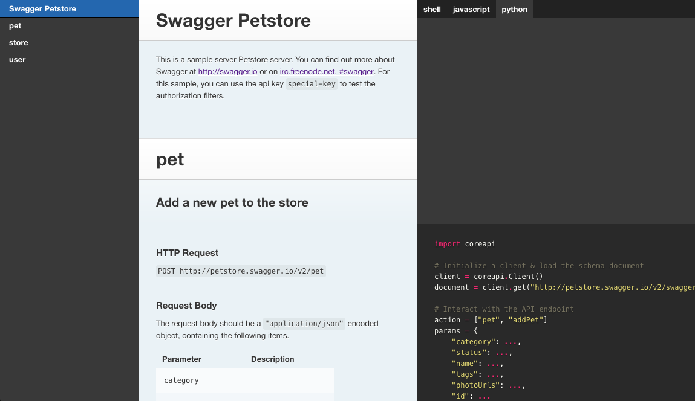
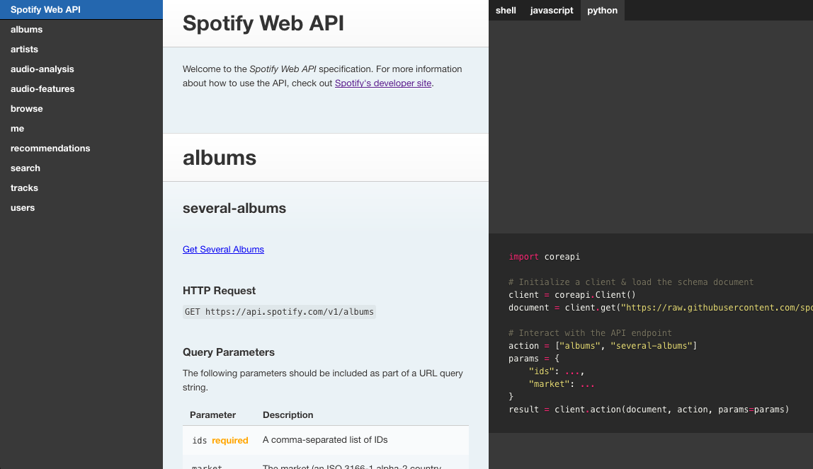

# CoreDocs

An API Documentation generator.

* **Code sample generation** - Automatic code samples for Python, Javascript, and the command line.
* **Schema support** - Currently supports [Swagger][swagger], [RAML][raml], and [JSON HyperSchema][jsonhyperschema].
* **Themes** - Currently includes the [Slate][slate] API documentation theme.
    Additional themes and support for theme customization is planned.

## Swagger example

The following will build API documentation for the Swagger "PetStore" example API.

    $ pip install coredocs
    $ pip install openapi-codec
    $ coredocs build http://petstore.swagger.io/v2/swagger.json --format openapi

## RAML example

The following will build API documentation for the Spotify API, based on their RAML schema.

    $ pip install coredocs
    $ pip install raml-codec
    $ coredocs build https://raw.githubusercontent.com/spotify/web-api/master/specifications/raml/api.raml --format raml

[swagger]: http://swagger.io/
[raml]: http://raml.org/
[jsonhyperschema]: http://json-schema.org/latest/json-schema-hypermedia.html
[slate]: https://github.com/lord/slate
